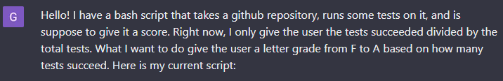
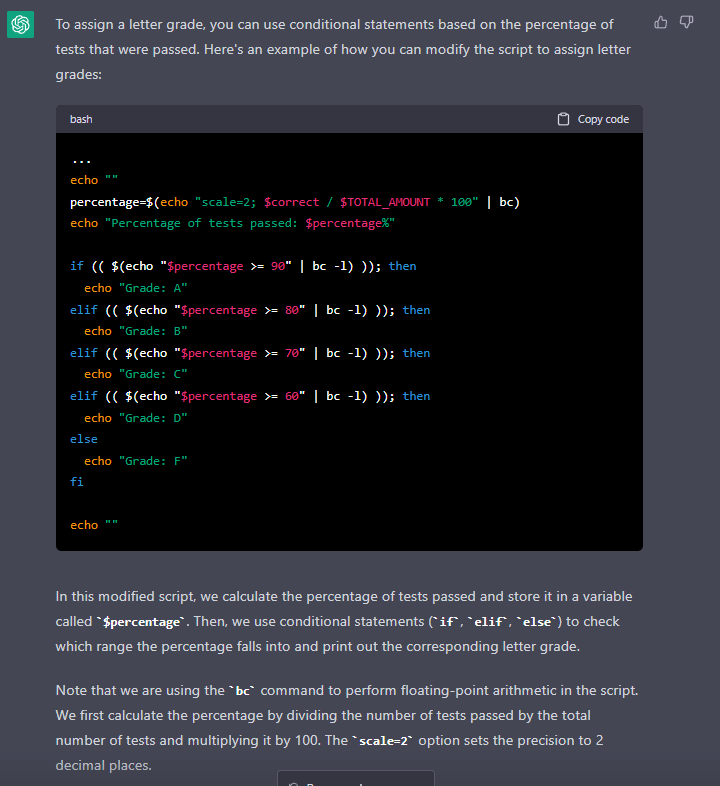
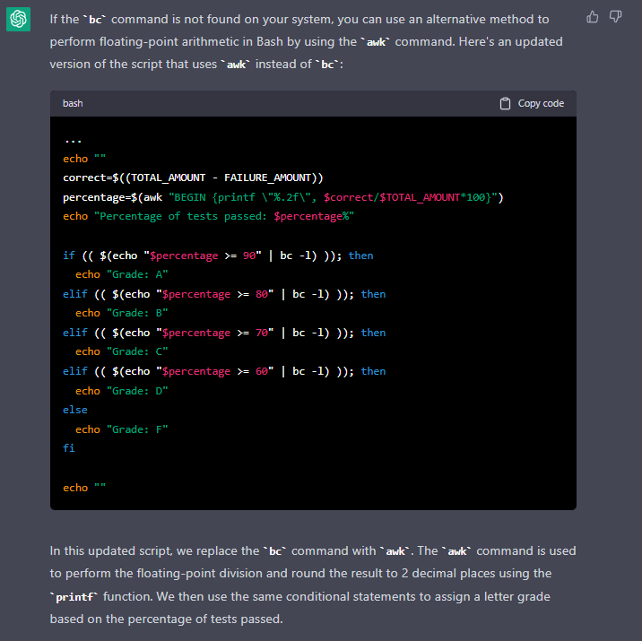

# **Lab Report 5**

## **Summary and finishing Lab 6**

-   For this lab report, I want to finish up my grading script from lab 6.
-   First, here is my existing grading script:

```
CPATH='.:lib/hamcrest-core-1.3.jar:lib/junit-4.13.2.jar'
TOTAL_AMOUNT=2

rm -rf student-submission
git clone $1 student-submission
echo 'Finished cloning'

# Check to see there is a file called ListExamples.java
if [[ -e ./student-submission/ListExamples.java && -f ./student-submission/ListExamples.java ]]
then
    echo 'ListExamples.java found! Continuing with tests...'
else
    echo 'ListExamples.java not found!'
    echo ""
    echo "0/$TOTAL_AMOUNT is the final score."
    echo ""
    exit
fi

# Copy our test code into the student's code
echo "Copying test code into student directory..."
cp TestListExamples.java ./student-submission/TestListExamples.java
cp -r ./lib ./student-submission/lib

# Compile all of the java files
echo "Compiling all java files..."
cd student-submission
javac -cp $CPATH *.java 2> javac-results.txt

# Detect if any errors happened
if [[ $? -ne 0 ]]
then
    echo "Error in compiling java files! Error messages below: "
    cat javac-results.txt
    echo ""
    echo "0/$TOTAL_AMOUNT is the final score."
    echo ""
    exit
else
    echo "Successfully compiled java files! Continuing with tests..."
fi

# Now running the tests on user code
echo 'Running tests on student submission...'
java -cp $CPATH org.junit.runner.JUnitCore TestListExamples > test-results.txt

# Get second line in test-results.txt. The amount of E's will tell us the amount of failures vs. successes.
# Command below was found here: https://stackoverflow.com/questions/19327556/get-specific-line-from-text-file-using-just-shell-script
sed '2!d' test-results.txt > parser-results.txt
# Command below was found here: https://unix.stackexchange.com/questions/387656/how-to-count-the-times-a-specific-character-appears-in-a-file
grep -o 'E' parser-results.txt | wc -l > failure-amount.txt
FAILURE_AMOUNT=`cat failure-amount.txt`
let "correct = $TOTAL_AMOUNT - $FAILURE_AMOUNT"
if [[ $correct -ne $TOTAL_AMOUNT ]]
then
    echo "Printing out JUnit output since there were errors!"
    cat test-results.txt
fi
echo ""
echo "$correct/$TOTAL_AMOUNT is the final score."
echo ""
```

-   There are a couple things that I want to do with this script:
    1. Right now, the total amount of tests must be explicitly stated in the bash script. This is a bit inconvenient, since if I ever want to add anymore tests, I have to manually edit this number.
    2. The final grading right now is a fraction, and somewhat hard to understand. It would be nice to give the person a final grade, from F to A, as doing so would make grading easier.
-   Throughout this lab report, I'll go through the process of these changes, then show the final grade script at the end.

### **1: Getting the Number of Tests**

-   I really don't like that I have to input the amount of tests manually. So, I want to be able to automatically get the number of tests.

#### **Method 1**

-   My first thought improvement was to make the number of tests an argument for the `grade.sh` script.
-   The way I did this was by changing `TOTAL_AMOUNT=2` to `TOTAL_AMOUNT=$2`.
-   This does make the script more flexible, as whenever we add another test, we do not have to directly change `grade.sh`, but rather just change the argument that we are passing in.
-   Here is an example output:

```
$ bash grade.sh git@github.com:ucsd-cse15l-f22/list-methods-corrected.git 2
Cloning into 'student-submission'...
remote: Enumerating objects: 3, done.
remote: Counting objects: 100% (3/3), done.
remote: Compressing objects: 100% (2/2), done.
ListExamples.java found! Continuing with tests...
Copying test code into student directory...
Compiling all java files...
Successfully compiled java files! Continuing with tests...
Running tests on student submission...

2/2 is the final score.
```

-   Even if we do not have to directly change the code to accomodate for new tests, this method is still a bit tedious, since it can be easy to forget to input the extra argument.
-   We also don't want to think about how many tests we have, but rather just make as many tests as we want, and for a final grade to be given.

#### **Method 2**

-   In order to automatically collect how many tests there are, we can count the number of lines that contain the string `@test`.
-   We will be using `grep` as well as `wc` to accomplish this.
-   First, we will grab all of the lines containing `@Test` using grep. The command I wrote here is:

```
grep "@Test" TestListExamples.java
```

-   Next, we want to count the number of lines that this `grep` command outputs. In order to do this, we'll use the pipe operator to take the output from `grep` and put it in `wc`.
-   We also want to use the `-l` option in `wc` so that `wc` will just output the number of lines we need, which is exactly what we want.
-   Last, I take the results of `wc` and put it into a file called `failure-amount.txt`. This is mainly for readability purposes.
-   The final command I put in my bash script is this:

```
grep "@Test" TestListExamples.java | wc -l > failure-amount.txt
```

-   We then put the contents of `failure-amount.txt` into the variable `TOTAL_AMOUNT` by using the cat command.

```
TOTAL_AMOUNT=`cat failure-amount.txt`
```

-   Now, the amount of tests is automatically calculated! We don't need to use an argument or change the script in any way if we add or delete any tests.
-   Last, here is an example output with an extra test that I put in.

```
$ bash grade.sh git@github.com:ucsd-cse15l-f22/list-methods-corrected.git
Cloning into 'student-submission'...
remote: Enumerating objects: 3, done.
remote: Counting objects: 100% (3/3), done.
remote: Compressing objects: 100% (2/2), done.
ListExamples.java found! Continuing with tests...
Copying test code into student directory...
Compiling all java files...
Successfully compiled java files! Continuing with tests...
Running tests on student submission...

3/3 is the final score.
```

### **2: Giving a Letter Grade**

-   At first, I wasn't really sure how to give a letter grade to the user.
-   During lecture, I saw that the professor used ChatGPT to try to write a program that would give a letter grade in the `grade.sh` script.
-   When I saw it, it looked like it would almost work. So, I decided to try it out and see if it could help me out.
-   Here is the prompt I gave ChatGPT:
-   
-   (I then pasted my whole `grade.sh`)
-   
-   Here was ChatGPT's response:
-   
-   This looks pretty good! it even was able to get my `$correct` and `$TOTAL_AMOUNT` variables correctly. I decided to copy this code and try it out in my script.
-   Here is the first output when I copied and pasted ChatGPT's script:

```
$ bash grade.sh git@github.com:ucsd-cse15l-f22/list-methods-corrected.git
Cloning into 'student-submission'...
remote: Enumerating objects: 3, done.
remote: Counting objects: 100% (3/3), done.
remote: Compressing objects: 100% (2/2), done.
remote: Total 3 (delta 0), reused 3 (delta 0), pack-reused 0
Receiving objects: 100% (3/3), done.
Finished cloning
ListExamples.java found! Continuing with tests...
Copying test code into student directory...
Compiling all java files...
Successfully compiled java files! Continuing with tests...
Running tests on student submission...

grade.sh: line 70: bc: command not found
Percentage of tests passed: %
grade.sh: line 73: bc: command not found
grade.sh: line 75: bc: command not found
grade.sh: line 77: bc: command not found
grade.sh: line 79: bc: command not found
Grade: F
```

-   There are definitely some problems here. The biggest issue is that the `bc` command is not found.
-   I then asked ChatGPT that I don't have access to the `bc` command, and if it could provide me with any alternatives.
-   
-   Here was ChatGPT's response:
-   
-   It did provide me alternatives for the `$percentage` variable, which is what I needed.
-   Unfortunately, the `bc` command is still in the various `if` statements, making this code still result in an error.
-   Here is the output when I copied this code into the `grade.sh`:

```
$ bash grade.sh git@github.com:ucsd-cse15l-f22/list-methods-corrected.git
Cloning into 'student-submission'...
remote: Enumerating objects: 3, done.
remote: Counting objects: 100% (3/3), done.

Percentage of tests passed: 100.00%
grade.sh: line 73: bc: command not found
grade.sh: line 75: bc: command not found
grade.sh: line 77: bc: command not found
grade.sh: line 79: bc: command not found
Grade: F
```

-   This is pretty close!
-   The `$percentage` variable is now accurate, which is the main part done! We now just need the `if` statements to work properly.
-   Fortunately, we can use what we learned in lecture about if statements in bash to get the correct behavior.
-   Instead of what ChatGPT gave us, I instead replaced each if condition with this:

```
[[ $percentage -ge __NUM__ ]]
```

-   I also changed the `$percentage` to have zero decimal places. This is so that the arithmetic runs correctly.
-   The final grade given part looks like this:

```
echo ""
echo "-----------------------------------------------------------------"

echo "Tests passed: $correct/$TOTAL_AMOUNT"

percentage=$(awk "BEGIN {printf \"%.0f\", $correct/$TOTAL_AMOUNT*100}")
echo "Percentage of tests passed: $percentage%"

# if (( $(echo "$percentage >= 90" | bc -l) )); then
if [[ $percentage -ge 90 ]]; then
  echo "Grade: A"
elif [[ $percentage -ge 80 ]]; then
  echo "Grade: B"
elif [[ $percentage -ge 70 ]]; then
  echo "Grade: C"
elif [[ $percentage -ge 60 ]]; then
  echo "Grade: D"
else
  echo "Grade: F"
fi

echo "-----------------------------------------------------------------"
echo ""
```

-   Here is a sample output with all tests passing:

```
$ bash grade.sh git@github.com:ucsd-cse15l-f22/list-methods-corrected.git
Cloning into 'student-submission'...
remote: Enumerating objects: 3, done.
remote: Counting objects: 100% (3/3), done.
remote: Compressing objects: 100% (2/2), done.
remote: Total 3 (delta 0), reused 3 (delta 0), pack-reused 0
Receiving objects: 100% (3/3), done.
Finished cloning
ListExamples.java found! Continuing with tests...
Running tests on student submission...

-----------------------------------------------------------------
Tests passed: 3/3
Percentage of tests passed: 100%
Grade: A
-----------------------------------------------------------------
```

-   And here is a sample output with some tests failing:

```
$ bash grade.sh git@github.com:ucsd-cse15l-f22/list-methods-lab3.git
Cloning into 'student-submission'...
remote: Enumerating objects: 3, done.
remote: Counting objects: 100% (3/3), done.
remote: Compressing objects: 100% (2/2), done.
remote: Total 3 (delta 0), reused 3 (delta 0), pack-reused 0
Receiving objects: 100% (3/3), done.
Finished cloning
ListExamples.java found! Continuing with tests...
Copying test code into student directory...
Compiling all java files...
Successfully compiled java files! Continuing with tests...
Running tests on student submission...
Printing out JUnit output since there were errors!
JUnit version 4.13.2
Tests run: 3,  Failures: 2


-----------------------------------------------------------------
Tests passed: 1/3
Percentage of tests passed: 33%
Grade: F
-----------------------------------------------------------------
```

## **Conclusion**

-   In conclusion, I was able to automatically find how many tests were in `TestListExamples.java` using first an argument, then using `grep` and `wc`.
-   I also was able to give the user a letter grade using first ChatGPT, then modifying the code to work properly.
-   Overall, this was a great project, and helped me understand my code and bash a little more.
-   Here is the final script:

```
# WINDOWS CPATH
CPATH='.;lib/hamcrest-core-1.3.jar;lib/junit-4.13.2.jar'

# MAC CPATH
# CPATH='.:lib/hamcrest-core-1.3.jar:lib/junit-4.13.2.jar'

grep "@Test" TestListExamples.java | wc -l > failure-amount.txt
TOTAL_AMOUNT=`cat failure-amount.txt`

rm -rf student-submission
git clone $1 student-submission
echo 'Finished cloning'

# Check to see there is a file called ListExamples.java
if [[ -e ./student-submission/ListExamples.java && -f ./student-submission/ListExamples.java ]]
then
    echo 'ListExamples.java found! Continuing with tests...'
else
    echo 'ListExamples.java not found!'
    echo ""
    echo "0/$TOTAL_AMOUNT is the final score."
    echo ""
    exit
fi

# Copy our test code into the student's code
echo "Copying test code into student directory..."
cp TestListExamples.java ./student-submission/TestListExamples.java
cp -r ./lib ./student-submission/lib

# Compile all of the java files
echo "Compiling all java files..."
cd student-submission
javac -cp $CPATH *.java 2> javac-results.txt

# Detect if any errors happened
if [[ $? -ne 0 ]]
then
    echo "Error in compiling java files! Error messages below: "
    cat javac-results.txt
    echo ""
    echo "0/$TOTAL_AMOUNT is the final score."
    echo ""
    exit
else
    echo "Successfully compiled java files! Continuing with tests..."
fi

# Now running the tests on user code
echo 'Running tests on student submission...'
java -cp $CPATH org.junit.runner.JUnitCore TestListExamples > test-results.txt

# Get second line in test-results.txt. The amount of E's will tell us the amount of failures vs. successes.
# Command below was found here: https://stackoverflow.com/questions/19327556/get-specific-line-from-text-file-using-just-shell-script
sed '2!d' test-results.txt > parser-results.txt
# Command below was found here: https://unix.stackexchange.com/questions/387656/how-to-count-the-times-a-specific-character-appears-in-a-file
grep -o 'E' parser-results.txt | wc -l > failure-amount.txt
FAILURE_AMOUNT=`cat failure-amount.txt`
let "correct = $TOTAL_AMOUNT - $FAILURE_AMOUNT"
if [[ $correct -ne $TOTAL_AMOUNT ]]
then
    echo "Printing out JUnit output since there were errors!"
    cat test-results.txt
fi

echo ""
echo "-----------------------------------------------------------------"

echo "Tests passed: $correct/$TOTAL_AMOUNT"

percentage=$(awk "BEGIN {printf \"%.0f\", $correct/$TOTAL_AMOUNT*100}")
echo "Percentage of tests passed: $percentage%"

# if (( $(echo "$percentage >= 90" | bc -l) )); then
if [[ $percentage -ge 90 ]]; then
  echo "Grade: A"
elif [[ $percentage -ge 80 ]]; then
  echo "Grade: B"
elif [[ $percentage -ge 70 ]]; then
  echo "Grade: C"
elif [[ $percentage -ge 60 ]]; then
  echo "Grade: D"
else
  echo "Grade: F"
fi

echo "-----------------------------------------------------------------"
echo ""
```
